# 8장. 동적 계획법

## 8.9 문제: Quantization

- Quantization : 양자화

  - 넓은 범위를 갖는 수들을 작은 수들로 근사화하는 손실 압축
  - 예를 들어
    - 5명 학생의 신장 :161, 164, 173, 178, 184  --> 3분류로 양자화: 160~ 2명, 170~ 2명, 180~ 1명

- 문제설명

  - 1000 이하의 자연수로 구성된 수열을 s개의 자연수로 양자화
    (수열과 s 는 주어진다)
  - 이 때, 각 숫자별로 오차 제곱의 합이 최소인 것을 구하라
  - 예를 들어 1 2 3 4 5 를 양자화하는 경우를 보면
    - { 1 2 3 4 5 } >>> { 2 2 3 3 3 }
      - 각 숫자별 오차 : -1 0 0 1 2
      - 각 숫자별 오차제곱의 합 : **6** = 1 + 0 +  0 +  1 + 4
    - { 1 2 3 4 5 } >>> { 2 2 2 4 4 }
      - 각 숫자별 오차 : -1 0 1 0 1
      - 각 숫자별 오차제곱의 합 : **3** = 1 + 0 + 1 + 0 + 1
    - 위에서는 2 2 2 4 4 로 양자화하는 것이 더 최소화된 값이다
    - 그 외에도 수 많은 경우가 있을 것이다

- 입력

  ```bash
  2 # 테스트케이스 수
  10 3  # n(수열의 길이), s(양자화를 위한 숫자의 개수)
  3 3 3 1 2 3 2 2 2 1 # 수열의 숫자들
  9 3
  1 744 755 4 897 902 890 6 777
  ```

- 출력

  ```bash
  0
  651
  ```

  

## 8.10 풀이: Quantization

- 하던 대로는 안 된다

  - 양자화 범위가 s=3 일 때, 무식하게 푼다고 가정하면
    - 입력가능한 수의 범위가 1000 이기 때문에 이것을 3개의 수로 양자화 한다는 것은 1000개에서 3개를 고르는 조합과 같다
    - s=3 이므로 1000C3 = **166,167,000** 경우의 수가 가능하다
    - 주먹구구 법칙으로 대충 1억이 넘어가면 실패할 확률이 높다
  - 만약, s가 10개라고 하면 1000C10 = 263,409,560,461,970,000,000,000
    - 시간 : 부분문제가 아무리 빨리 해결된다고 해도 불가능해 보인다
    - 공간 : 메모이제이션을 쓰면 메모리 공간을 다 써버릴 것이다
  - 결론 : 무식하게 풀기(완전탐색)는 실패할 확률이 높다 --> 동적계획법이 필요하다는 느낌을 는다

- 답의 형태 제한하기

  - 접근방법

    - 손으로 몇 개 풀어보자
    - 규칙을 발견했다 : a<b 일 때, **a의 양자화값 <= b의 양자화값**
      - 예를 들어, { 1 2 3 4 } 를 양자화하는데 최적해가 { 2 2 3 2 } 일리가 없다  
        4 - 2 = 2 , 이고 4 - 3 = 1 이므로, 4는 3으로 양자화되어야 오차가 작아진다
    - 규칙을 일반화해보자
      - 수열값이 크면 양자화 값도 (같거나) 더 커져야 한다 
      - 따라서 주어진 수열을 정렬한다면, 같은 숫자로 양자화되는 수열값들은 모여 있게 된다
    - 전략
      - 수열을 정렬한다
      - 같은 양자화값을 사용할 s개 그룹으로 나눈다
      - 각 그룹별 **최소 오차제곱의 합**을 구한다
      - 예시
        - 원소개수(n)가 9개인 수열, 3개(s)로 양자화
        - { 1, 4, 6, 744, 755, 777, 890, 897, 902 }
        - { 1, 4, 6 }, { 744, 755, 777 }, { 890, 897, 902 }
        - 1그룹 = 4 , 2 그룹 = 759 , 3그룹 = 896

  - 아래 점화식을 수립하여 재귀함수 호출구조를 완성한다

    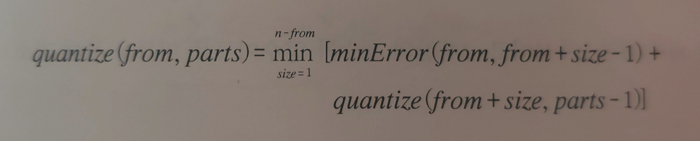

    - 변수소개
      - n = 수열의 크기 / 고정 = 10
      - from = 수열에서 index 위치 / 최초값 = 0
      - parts = 만들수 있는 그룹개수 / 최초값 = 3
      - size ~ (n - from) = 수열에서 남은 원소개수
    - minError(a, b) 함수는 a~b 구간의 최소오류 제곱합을 반환한다
    - 점화식의 의미
      - 수열에서 그룹의 크기를 변화시키면서 그 중에 최소값인 minError 를 구한다는 것이다
      - 중요한 것은 첫번째를 구한결과가 다음 결과에 영향을 미치지 않는다 >> 최적부분문제 (참조적투명성)
    - 기억할 내용
      - 동적계획법은 곧 점화식이라고 봐도 된다
      - 여기서 점화식은 2가지를 충족해야 한다 : 참조적 투명성 + 최적 부분문제
      - memoization을 적용하려면 최적 부분문제여야만 하기 때문에 동적계획법이 곧 점화식이다

- minError 함수 최적화

  - minError 함수는 한 구간에 대한 최소오류 제곱합 구한다

  - 이것은 부분문제의 수행속도를 결정하므로 빠를수록 좋다

  - 무식하게 풀기

    - n x 1000 같은데 책에서는 n^3 x 1000 이라 함

  - 미분 이용해보기

    - minError 의 시간복잡도를 더 줄여보고자 함

    - 오차제곱의 합은 아래에서 왼쪽과 같이 표현된다 =  (A[i]-m)^2

      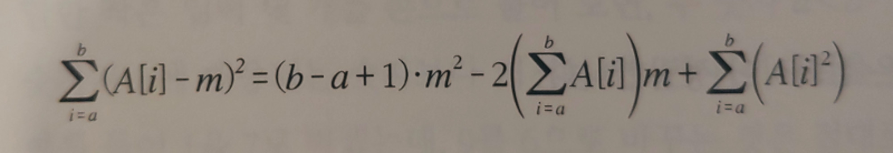

    - m이 우리가 구하려는 최소오차값이다

    - 여기서 (b-a+1) 이 양수이므로 위의 2차 방정식은 최소값을 가지는 그래프이다 (아래로 볼록한 포물선)

    - 최소값의 접선은 x축에 평행하므로 기울기가 0이다

    - 결과적으로 **위 공식의 미분 = 0** 이라는 방정식을 세우면 m 의 최소값을 구할 수 있다  

      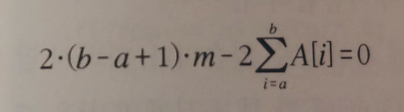

    - 위 식을 m 에 대해 정리하면 아래와 같은데 가만히 보면 우측변은 어떤 값들의 평균을 구하는 공식이다  
또한, sigma가 수열값 개수만큼 반복하므로 이 때의 복잡도는 O(n) 이다


  - 더 줄이자 (부분합 이용하기)

    - 평균을 구할 때, O(n)에서 더 줄여보자

    - O(n)은 덧셈 때문인데, 부분합을 이용하면 O(1) 에 해결할 수 있다 (17장에서 자세하게 소개)

    - 일단, k 인덱스까지의 합을 pSum[k] 라고 하자  

      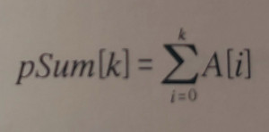

      

    - 그러면 아래 공식도 성립하는데, 전체에서 일부분을 빼면 나머지를 구할 수 있다는 의미이다  
      (이것들은 재귀함수 시작전에 미리 계산해 둘 것이다)  
      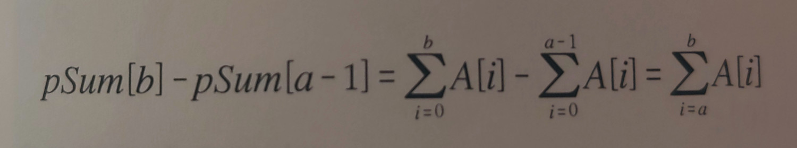

    - 이제 **오차제곱의 합** 이차방적식으로 돌아와보면, A[i]가 이미 구해져 있기 때문에 아래 식은 O(1) 이다  
      m 에 평균을 대입하면 아래 식은 최소오차 제곱을 알려줄 것이다  
      이제 이 결과들은 소스코드에서 그대로 사용한다  
      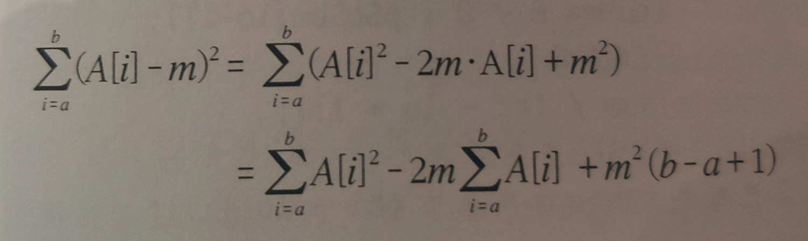

  - 구현

    ```c++
    #include <iostream>
    #include <algorithm>

    using namespace::std;

    const int INF = 987654321;

    // A[] : 양자화해야 할 수열 (정렬된 상태)
    // pSum[] : A[] 의 부분합을 저장, pSum[i] = A[0] ~ A[i] 의 합
    // pSqSum[] : A[] 제곱의 부분합을 저장, pSqSum[i] = A[0]^2 ~ A[i]^2 의 합
    // 2개 모두, 최소값 공식에서 사용되기 때문에 미리 구해 놓는 것이다
    int n = 9;
    int A[9] = { 1, 744, 755, 4, 897, 902, 890, 6, 777 };
    int pSum[9], pSqSum[9];

    // A를 정렬라고 각 부분합을 미리 계산한다
    // 최초 1번만 미리 실행될 것이다, 재귀함수에서는 부르지 않는다
    void precalc() {
      sort(A, A + n);
      pSum[0] = A[0];
      pSqSum[0] = A[0] * A[0];

      for (int i = 1; i < n; ++i) {
        pSum[i] = pSum[i - 1] + A[i];
        pSqSum[i] = pSqSum[i - 1] + A[i] * A[i];
      }
    }

    // A[lo] ~ A[hi] 구간을 하나의 숫자로 표현할 때, 최소 오차합을 계산
    int minError(int lo, int hi)
    {
      // 부분합을 이용해 A[lo] ~ A[hi] 까지의 합을 구함
      // sum : 최소값을 구하려면 평균이 필요하기 때문에 sum도 필요하다
      // sqSum : 역시 위에서 증명한 공식을 계산하려면 필요하다
      int sum = pSum[hi] - (lo == 0 ? 0 : pSum[lo - 1]);
      int sqSum = pSqSum[hi] - (lo == 0 ? 0 : pSqSum[lo - 1]);

      // 평균 m 을 구한다 (반올림)
      int m = int(0.5 + (double)sum / (hi - lo + 1));

      // sum	(A[i] - m)^2 를 전개한 결과를 부분합으로 표현
      // m 을 이용한 오차제곱이 최소임을 우리는 이미 알고 있다
      int ret = sqSum - 2 * m * sum + m * m * (hi - lo + 1);
      return ret;
    }

    // 100은 수열의 최대 길이 = n, 11은 양자화 그룹의 최대개수 = s
    // O(ns)
    int cache[9][9];

    int quantize(int from, int parts) {
      // 기저사례
      if (from == n)
        return 0;

      // 기저사례 : 숫자는 아직 남았는데 더 묶을 수 없을 때 아주 큰 값을 반환한다
      if (parts == 0)
        return INF;

      int& ret = cache[from][parts];

      if (ret != -1)
        return ret;

      ret = INF;

      // 조각의 길이를 변화시켜 가며 최소치를 찾는다
      for (int partSize = 1; from + partSize <= n; ++partSize)
        ret = min(ret, minError(from, from + partSize - 1) + quantize(from + partSize, parts - 1));

      return ret;
    }

    int main() {

      precalc();
      memset(cache, -1, sizeof(int)*11*11);

      std::cout << quantize(0, 3) << std::endl;

      int a;
      cin >> a;
    }
    ```
  - 함수호출
    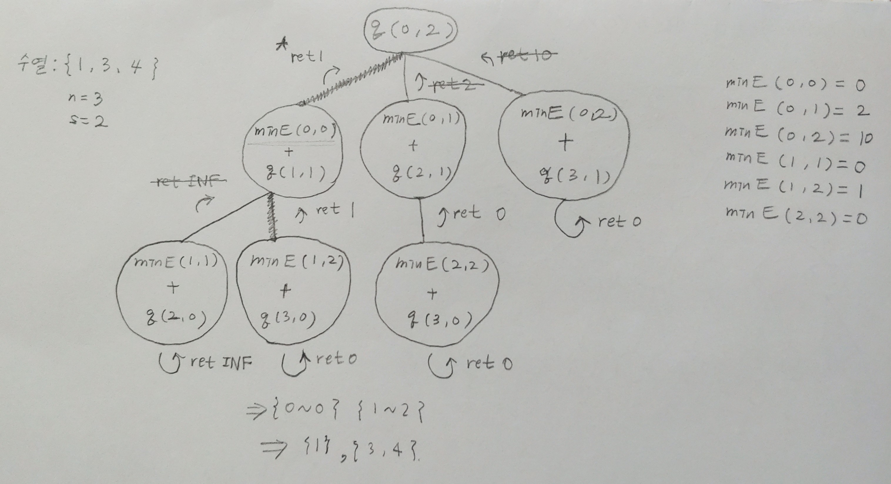
    
  - 전체 복잡도

    - 부분문제의 개수는 O(ns) =  수열크기(n) x 구간개수(s) 이다
      - 점화보고 유추하면 가장 좋지만 쉽지는 않다
      - 소스코드를 보면 쉽게 알 수 있는데 memoization용 cache 크기를 보면 기본적으로 파악이 된다
      - 또한, 실제로 몇 개의 경우를 해보면 알 수 있다  
      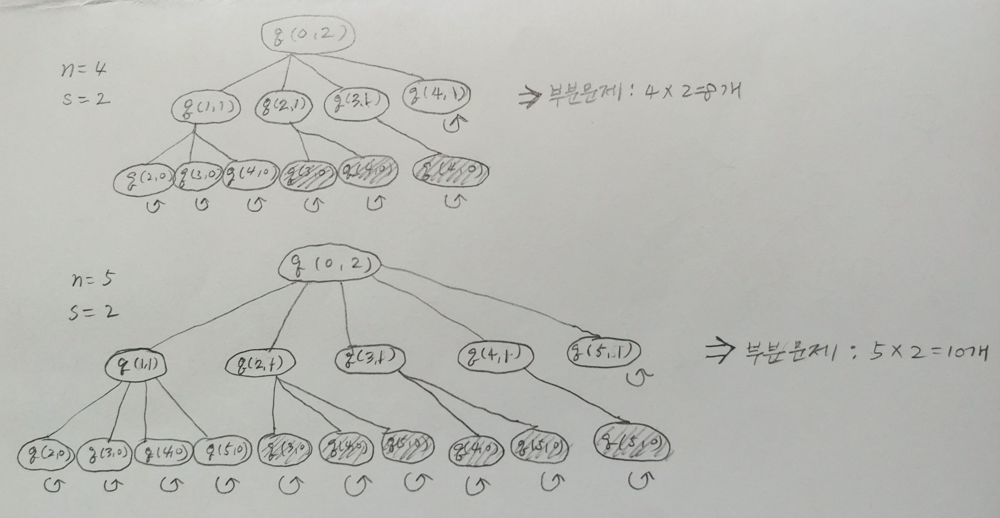
    - 1개 구간의 최소오차제곱 = minError(a,b) 의 시간복잡도는 O(1) 이다
    - 전체 시간복잡도는 O(ns) 가 되어야 할 것 같은데, 책에는 O(ns) x O(n) 이라고 되어 있다 (?)
    

## 8.11 경우의 수와 확률

- 예제: 타일링 방법의 수 세기

  - 아래 그림처럼 2 x n 크기의 벽면이 있다

  - 이것을 2 x 1 크기의 타일로 채우는 방법의 개수를 구하라

  - 타일은 가로 혹은 세로로 배치될 수 있다

  - 예를 들어 벽면의 크기가 2x5 (n=5) 이면, 2x1 크기의 타일로 가득 채울 수 있는 방법은 총 **8개**이다  
    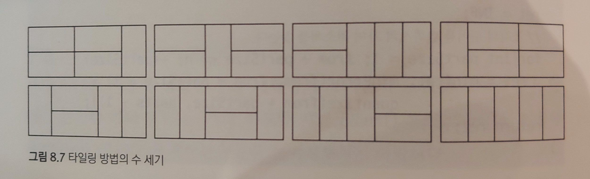

  - 전략

    - 완전탐색을 이용해 모든 답을 만들어보자

    - 다음으로 memoization 이용하여 최적화한다

    - 일단, 경우의 수를 좀 줄여보자

      - 덮어나가는 순서 강제화하기
      - 왼쪽부터 채워나간다고 가정하면, 아래와 같은 2가지 경우를 생각해 볼 수 있다
        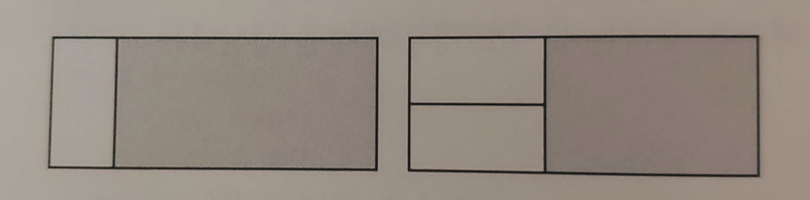

    - 위에처럼 순서를 강제화 했는데, 문제 없을까? 

      - 이 2개의 분류는 타일링하는 방법을 모두 포함한다 (2개 외에는 방법이 없다)
      - 이 2개의 분류에 모두 포함되는 타일링 방법은 없다 (서로 독립적이다)

    - 경우의 수를 구하는 문제에서는 항상 위의 조건들처럼 모든 상황을 만족하는 가설인지 확인해야만 한다

      - 이것을 잘못했을 때를 예를 들면 >> 모든 한국인의 수를 세려고 한다면
        - 1번 조건이 잘못되면 : 모든 한국인은 부산사람이거나 대전 사람이다라는 오류와 같음  
          (다른 도시사람들은 찾지 못함)
        - 2번 조건이 잘못되면 :  모든 한국인이 열살 이상 혹은 미성년자라고 생각하는 오류와 같음  
          (열살이 넘으면서 미성년자라면 중복발생)

    - 다행이 이 문제에서는 위 두가지 조건에 빈큼이 없다

    - 덮어나가는 순서를 강제화한 그림을 다시 보면

      - 남은 타일의 개수는 2 x (n-1) 이거나 2 x (n-2) 개 이다
      - 또한 중요한 것은, 이미 채운부분은 신경쓰지 않아도 된다는 점이다

    - 결과적으로 아래와 같은 점화식을 만들 수 있다

      ```
      tiling(n) = tiling(n-1) + tiling(n-2)
      ```

    - 재귀함수는 아래와 같다

      ```c++
      const int MOD = 1000000007;
      int cache[101];
      
      // 2 * width 크기의 사각형을 채우는 방법의 수를 MOD로 나눈 나머지를 반환한다
      int tiling(int width)
      {
        // 기저 사례 : width 가 1 이하일 때
        if(width <= 1)
          return 1;
          
        // 메모이제이션
        int& ret = cache[width];
        if(ret != -1)
          return ret;
        
        return ret = (tiling(width-2) + tiling(width-1)) % MOD;
      }
      ```

    - 그림으로 보면 아래와 같으며, 메모이제이션으로 중복부분(검은색)을 건너뛰면 시간 복잡도는 O(n)이 된다
      .jpg)

- 예제 : 삼각형 위의 최대 경로 개수 세기

  - 8.4절에서 봤던 삼각형 문제의 확장판이다
    (아래 or 대각선 아래 방향으로만 이동해서 최대가중치 경로 찾기)

  - 이전에는 최대 경로의 값만 구했다면, 여기서는 최대 경로의 개수를 구하는 것이다

    - 무슨 말이냐면 최대경로가 1개보다 많을 수 있다
    - 아래 그림에서 { 9 7 2 6 } , { 9 7 3 5 } 경로는 2개 모두 경로의 합이 24이며 동시에 최대 경로이다
    - 게다가 { 9 7 3 5 } 는 2번 등장한다

    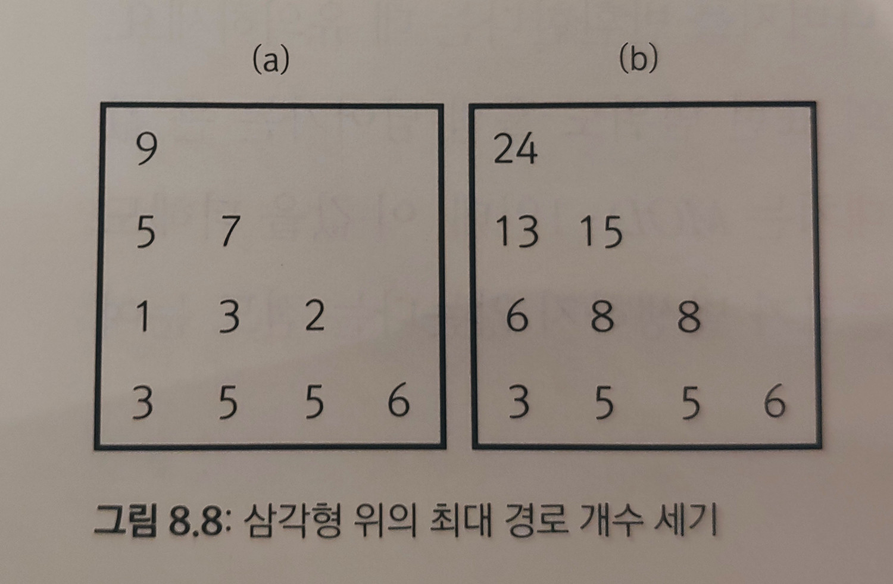

  - 전략

    - a는 각 좌표가 가지는 값을 그대로 보여준다
    - b는 **현재좌표 값 + 다음 경로 전체의 최대값** 을 거꾸로부터 구한 것을 보여준다
    - 그림 b를 자세히 보자
      - #1 : 만약 부모좌표에서 선택할 수 있는 (최대값) 방향이 1개라면, 부모와 자식이 가지는 최대경로 개수는 같다
      - #2 : 만약 자식좌표 2개가 가지는 값이 같다면, 부모좌표에서 가능한 (최대값) 개수는 자식 2개가 가지는 개수를 더한 것이다
    - 위의 내용을 점화식을 통해 일반화해보자
      - 만약, path2(y+1, x) > path2(y+1, x+1) 이면 --> count(y+1, x)
      - 만약, path2(y+1, x) < path2(y+1, x+1) 이면 --> count(y+1, x+1)
      - 만약, path2(y+1, x) = path2(y+1, x+1) 이면 --> count(y+1, x) + count(y+1, x+1)
        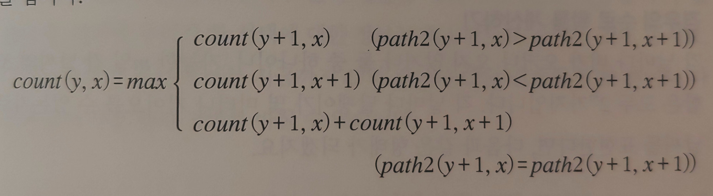
    - 다 됐다, 8.9절의 path2() 함수를 그대로 가져다가 count() 함수를 구현한다  
      (※ path2() 함수는 memoization을 사용하기 때문에 여러번 쓰더라도 문제가 없다)

  - 소스코드 및 분석

    - path2() 함수 먼저보자

      ```c++
      int n, triangle[100][100];
      int chache2[100][100];
      
      // (y,x) 위치부터 맨 아래줄까지 내려가면서 얻을 수 있는 초대 경로의 합을 반환한다
      int path2(int y, int x)
      {
        // 기저사례
        if(y == n-1)
          return triangle[y][x];
      
        // 메모이제이션
        int& ret = cache2[y][x];
        if(ret != -1)
          return ret;
          
        return ret = max(path(y+1, x), path2(y+1, x+1)) + triangle[y][x];
      }
      ```

      .jpg)

    - count() 함수

      ```c++
      int countCache[100][100];
      // (y,x}에서 시작해서 맨 아래줄까지 내려가는 경로 중 최대 경로의 개수를 반환한다
      
      int count(int y, int x)
      {
        // 기저사례 : 맨 아래줄에 도달한 경우
        if(y == n-1)
          return 1;
          
        // 메모이제이션
        int& ret = countCache[y][x];
        
        if(ret != -1)
          return ret;
          
        ret = 0;
        
        if (path2(y+1, x+1) >= path2(y+1, x))
          ret += count(y+1, x+1);
      
        if (path2(y+1, x+1) <= path2(y+1, x))
          ret += count(y+1, x);
      }
      ```

      .jpg)

- 예제: 우물을 기어오르는 달팽이

  - 확률과 경우의 수

    - 2가지 문제는 한 끗 차이다, 확률의 정의가 **가능한 경우의 수 / 전체 경우의 수** 이기 때문이다
    - 지금까지 경우의 수를 구하는 문제를 계속 풀었는데, 확률문제는 이것을 그대로 이용하면 된다

  - 먼저 본 예제에서는 경우의 수를 구하고 다음 예제에서 확률문제로 확장해 본다

  - 문제

    - 달팽이는 아래처럼 움직일 수 있다
      - 해가뜬날은 하루에 **2 미터** 이동
      - 비오는날은 하루에 **1 미터** 이동
    - 앞으로 m 일간 각 날에 비가올 확률은 50%이다
    - m 일 안에 달팽이가 n 미터의 우물을 빠져나올 확률은 얼마나 될까?

  - 경우의 수를 따져보자

    - 하루만 놓고 보면 비가 올 확률은 50% 이므로 2가지이다

    - 이제 가능한 경우의 수는2^m 이 된다, 즉 4일이라고 하면 2^4 = 16 가지 경우의 수가 있다

    - O는 비오는 날, X는 비 안오는 말

      ```
      { O O O O }
      { O O O X }
      ....
      { X X X O }
      { X X X X }
      ```

      ※ 위에서 달팽이가 탈출 성공하는 경우의 수를 16으로 나눠주면 사실 확률이다

  - 완전탐색 알고리즘

    - 기저사례로 전체일수 m이 0 되었을 때를 가정하면 m은 재귀함수들이 공유해야 한다 (= days)
    - m 이 0일때, 각 경로에서 우물을 탈출했는지 확인하려면 이동한 거리를 알고 있어야 한다 (= climbed)

  - 소스코드는 아래와 같다

    ```c++
    int n, m;
    
    // 재귀함수가 2개씩 갈라지므로 x2
    int cache[MAX_N][2*MAX_N + 1];
    
    int climb(int days, int climbed)
    {
      // 기저사례 : m일이 모두 지난 경우
      if (days == m)
        return clibmed >= n ? 1 : 0;
    
      // 메모이제이션
      int& ret = cache[days][climbed];
      
      if (ret != -1)
        return ret;
        
      return ret = climb(days+1, climbed+1) + climb(days+1, climbed+2);
    }
    ```

  - 호출구조는 아래와 같다  
    .jpg)

- 예제: 장마가 찾아왔다

  - 이제 위의 달팽이 문제를 확률 문제로 변경한다

    - 즉, 최종 반환값이 확률이다
    - 근데 실제로 해야하는 일은 아주 간단하다

  - 일단, 비가 올 확률이 50% --> 75% 로 변경되었다

  - 전략

    - 위의 경우의 수 문제를 그대로 사용

    - 재귀함수의 결과에 각각이 발생 할 확률만 곱해주면 된다

      - 비오는날 확률 : 75%
      - 해가뜬날 확률 : 25%

    - 그러한 점화식은 아래와 같다

      ```
      climb2(days, climbed) = 0.75 x climb2(days + 1, climbed + 1) + 0.25 x climb2(dyas + 1, climbed + 2)
      ```

  - 경우의 수 문제와 다른 점음 return 값이 확률이라는 것 뿐이다 (문제가 애초에 확률을 구하는 문제이다)

  - 소스코드는 없고 아래 호출 구조를 보자, 최종적으로 0.xxx 라는 확률이 반환된다  
    이처럼 **경우의 수 문제 , 확률 문제**는 동일한 방법으로 풀 수 있다 (완전탐색)

    .jpg)
